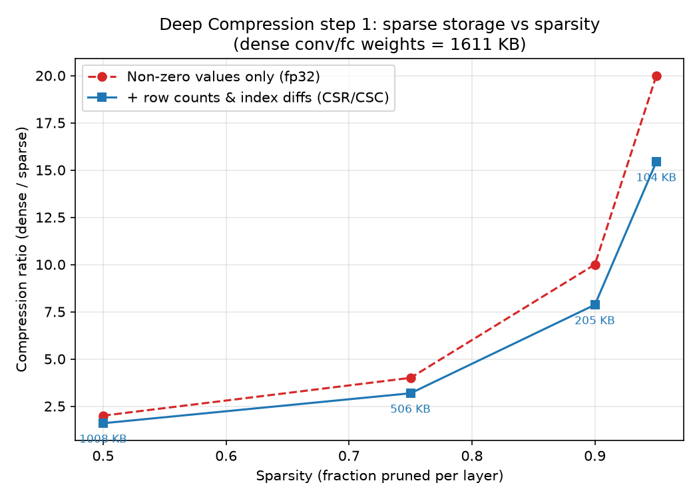
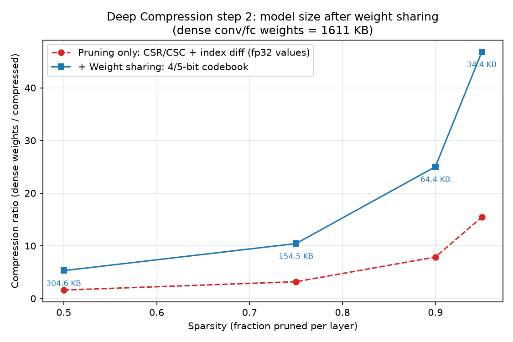
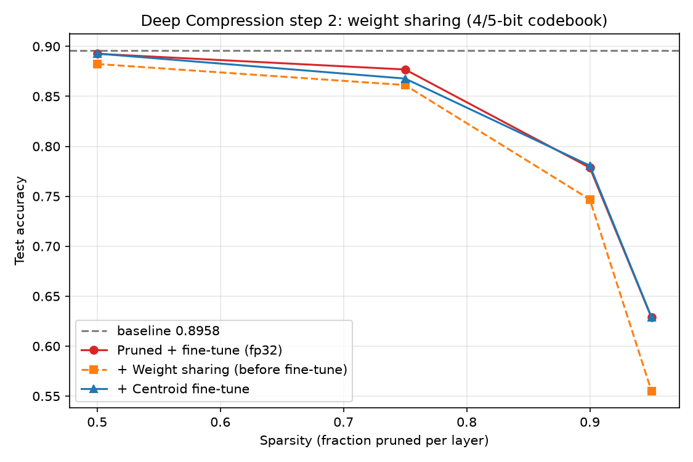
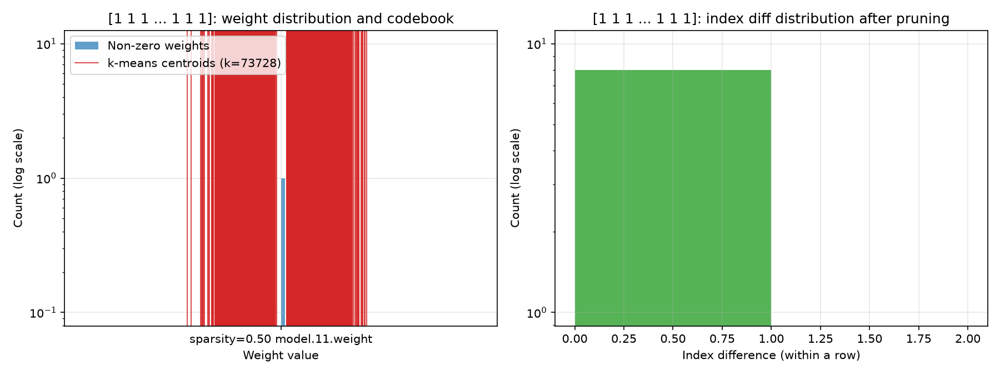
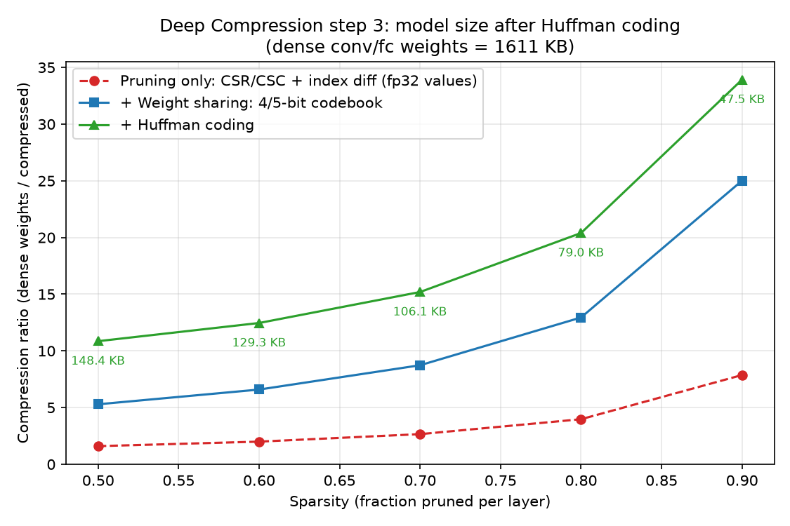

# my-llm-pruning

*使用AI进行代码生成*

尝试复现以下论文中的剪枝操作

1. [Deep Compression: Compressing Deep Neural Networks with Pruning, Trained Quantization and Huffman Coding](https://arxiv.org/abs/1510.00149)
2. [SparseGPT: Massive Language Models Can be Accurately Pruned in One-Shot](https://arxiv.org/abs/2301.00774)
3. [A Simple and Effective Pruning Approach for Large Language Models](https://arxiv.org/abs/2306.11695)

受限于算力，会使用以下模型和数据集

- 从AlexNet修改而来的CNN网络（总参数量 413962） + CIFAR10数据集
- Qwen2.5-3B-Instruct + MATH500数据集

前者我能够快速本地训练和测试，后者我勉强能在本地完成推理

## Deep Compression

```shell
python model.py
python pruning.py
python compression.py --stage sparse|quant|huffman
```

### 文件

```
|   log_baseline.txt
|   log_prune.txt
|   log_compression.txt
|   model.py                    # 训练和评测模型
|   plotting.py                 # 画图相关
|   pruning.py                  # 剪枝、微调和再评测
|   sparse_format.py            # 稀疏存储格式：CSR/CSC + index diff
|   weight_sharing.py           # 权重共享：逐层 k-means 量化 + centroid 微调
|   huffman.py                  # Huffman 编码
|   compression.py              # 剪枝之后步骤的脚本
|   pruning_results.png
|   pruning_size_results.png
|   sparse_size_results.png
|   quant_size_results.png
|   quant_accuracy_results.png
|   weight_distribution.png
|   huffman_size_results.png
```

### 剪枝

- 常规训练
- 每层的权重里（无偏置），对于大小小于该层分位数sparsity的权重，直接置为0，得到一个稀疏的网络（非结构化剪枝）
- 再对这个稀疏网络进行微调（使用掩码mask仅对剩余权重进行梯度下降）

### 剪枝+微调结果


不微调单纯剪枝几乎是不可行的


这里的压缩比基本上等于 `1/(1-sparsity)`，因为当时只统计了非零值，没有算索引开销

### CSR+index diff

对于剪枝后的稀疏网络：

- CSR/CSC格式存储
- 对于CSR下的col_idx数组（或者CSC下是row_idx），再使用index diff储存方式进一步压缩，对于conv层仅需8bits/fc层5bits来存储索引
  - 如果diff超出上限，填充0

### 压缩结果

- conv 权重 `(out, in, kh, kw)` 展平成 `(out, in*kh*kw)` 按行存 **CSR**，fc 权重 `(out, in)` 转置后按行存 **CSC**；
  index 流存同一行内的索引差值（行首是相对位置 0 的差值，即绝对索引），conv 8 bits / fc 5 bits
- 差值超过位宽上限时按上限拆成多步并插入 filler 占位（未量化时 filler=0，量化后是保留符号 -1），解码时跳过、不改变权重；
  本实验 filler 实际为 0（conv 最大差值 229 < 255，fc 行内 9 < 31，说明这两个位宽够用）
- 每行另存 16 bits 的真实非零个数，用于区分"一行结束"与"下一行开始"；这一步的值流仍是 fp32

稀疏存储不改变模型权重，因此也不影响准确率

| sparsity | kept | acc | 值流 KB | index KB | 行计数 KB | 合计 KB | 落盘文件 KB | 压缩比 |
| -------- | ---- | --- | ------- | -------- | --------- | ------- | ----------- | ------ |
| 0.50 | 0.5000 | 0.8926 | 805.69 | 198.61 | 3.94 | 1008.23 | 1014.66 | 1.60x |
| 0.75 | 0.2500 | 0.8769 | 402.84 | 99.30 | 3.94 | 506.09 | 512.47 | 3.18x |
| 0.90 | 0.1000 | 0.7786 | 161.15 | 39.72 | 3.94 | 204.81 | 210.97 | 7.87x |
| 0.95 | 0.0500 | 0.6287 | 80.58 | 19.86 | 3.94 | 104.38 | 110.47 | 15.44x |

索引需要额外开销，最后实现相比只存储非零值77%~80%的压缩率

（以下各节的压缩比都以 dense conv/fc 权重 1611.38 KB 为分母；bias/BN ≈ 9.45 KB 不压缩，随文件原样保存）



### 权重共享

对于**每一层剪枝后**的权重矩阵（或者是values向量），通过linear初始化得到本组的centroid作为共享权重，再使用一个低位数的cluster index矩阵即可让原权重矩阵映射到（少得多的）centroids数组（也叫codebook）上

再将梯度也进行相同分组，把每组的累积梯度作为centroid的梯度，对共享权重进行微调

逐层独立进行的，不同层之间不共享权重

### 权重共享结果

- 位宽用论文默认值：conv 4 bits（k=16）、fc 5 bits（k=32）；**逐层独立**做 k-means，输入是该层剪枝后剩下的非零权重，
  centroid 用 min/max 线性初始化，再跑 Lloyd 迭代（上限 100 次，不再移动就提前结束）
- 量化把每个非零权重换成离它最近的 centroid：值流由 fp32 变成 `bits` 位的 cluster index，另存 k 个 fp32 的 codebook
- 微调：`SharedWeightConv2d` / `SharedWeightLinear` 用 `codebook[indices]` 重建稠密权重前向，反传时 autograd 自动把同一 cluster 的
  梯度累加到该 centroid 上（等价于论文的"按组累加梯度更新共享权重"）；**index 与剪枝 mask 全程不变**，bias/BN 照常训练
- 每个 epoch 都存一份完整 state_dict（centroid + bias/BN），最后回退到测试集准确率最高的那个 epoch，避免末轮抖动
- 落盘文件自包含（index 位流 + codebook + 行计数 + bias/BN），可只用 `quant_s*.pt` 重建模型评测

| sparsity | nnz | acc（剪枝） | acc（量化） | acc（微调） | 值流 KB | index KB | codebook KB | 行计数 KB | 合计 KB | 压缩比 |
| -------- | --- | ----------- | ----------- | ----------- | ------- | -------- | ----------- | --------- | ------- | ------ |
| 0.50 | 206256 | 0.8926 | 0.8824 | 0.8928 | 101.65 | 198.61 | 0.438 | 3.94 | 304.63 | 5.29x |
| 0.75 | 103128 | 0.8769 | 0.8613 | 0.8678 | 50.82 | 99.30 | 0.438 | 3.94 | 154.50 | 10.43x |
| 0.90 | 41254 | 0.7786 | 0.7468 | 0.7807 | 20.33 | 39.72 | 0.438 | 3.94 | 64.43 | 25.01x |
| 0.95 | 20628 | 0.6287 | 0.5552 | 0.6291 | 10.17 | 19.86 | 0.438 | 3.94 | 34.40 | 46.84x |

这一步只改了值流（32 bits → conv 4 / fc 5 bits），index 流与行计数和 step 1 相同，所以收益随稀疏度放大：
1.60x→5.29x、7.87x→25.01x、15.44x→46.84x；逐层量化 RMSE 只有 0.004~0.013。







### 霍夫曼编码

经过上述操作之后，权重的大小分布在两个峰值附近，权重diff index的分布高度偏向0的一侧，对两者分别使用huffman coding进一步减小16%~51%的空间

### huffman coding结果

- 每层两条流分别编码：**值流**（cluster index，字母表大小 k）和 **index 差值流**（字母表 `1 << index_bits`，conv 256 / fc 32）
- 最小堆建树，再由码长生成**规范码**（落盘只需存码长表，不用存码表本身）；位流 MSB-first 打包，与 `sparse_format` 的约定一致
- filler 用 `offset=1` 统一偏移，保证符号从 0 开始（本实验 filler 为 0，故 offset 为 0）
- 行计数（16 bits）与 codebook 不参与 Huffman（论文里也没编码它们），两条码长表合计约 1.39 KB

| sparsity | acc | 值流 KB | index 流 KB | 码长表 KB | 行计数+codebook KB | 合计 KB | 压缩比 | 相对 step 2 |
| -------- | --- | ------- | ----------- | --------- | ------------------ | ------- | ------ | ----------- |
| 0.50 | 0.8928 | 92.16 | 50.58 | 1.39 | 4.38 | 148.51 | 10.85x | -51.3% |
| 0.75 | 0.8678 | 46.50 | 40.79 | 1.39 | 4.38 | 93.05 | 17.32x | -39.8% |
| 0.90 | 0.7807 | 18.84 | 22.96 | 1.39 | 4.38 | 47.56 | 33.88x | -26.2% |
| 0.95 | 0.6291 | 9.40 | 13.74 | 1.39 | 4.38 | 28.91 | 55.73x | -16.0% |

index 差值流是主要受益者：低稀疏度时差值几乎全落在 0/1，实测只要 1.88~2.03 bits/符号（定长分别是 8 / 5 bits），已经很接近它的熵 1.83~2.02；
值流因为 cluster index 接近均匀分布，逐层只能省 5%~15%（3.3~4.0 bits/符号）。

落盘文件 `compressed_s*.pt` 还带 bias/BN 与文件头（例如 0.50 是 178.48 KB）；只用该文件重建模型，权重与 step 2 逐位相同（最大偏差 0），准确率一位不差。



### 结论

| sparsity | acc（剪枝） | acc（+权重共享） | acc（+Huffman） | 稀疏 KB | +权重共享 KB | +Huffman KB | 稀疏 | +权重共享 | +Huffman |
| -------- | ----------- | ---------------- | --------------- | ------- | ------------ | ----------- | ---- | --------- | -------- |
| 0.50 | 0.8926 | 0.8928 | 0.8928 | 1008.23 | 304.63 | 148.51 | 1.60x | 5.29x | 10.85x |
| 0.75 | 0.8769 | 0.8678 | 0.8678 | 506.09 | 154.50 | 93.05 | 3.18x | 10.43x | 17.32x |
| 0.90 | 0.7786 | 0.7807 | 0.7807 | 204.81 | 64.43 | 47.56 | 7.87x | 25.01x | 33.88x |
| 0.95 | 0.6287 | 0.6291 | 0.6291 | 104.38 | 34.40 | 28.91 | 15.44x | 46.84x | 55.73x |

Huffman 是无损的，所以最后两列准确率相同；相对 baseline 0.8958，压缩本身几乎不损失准确率，准确率的下降几乎全部来自剪枝那一步。