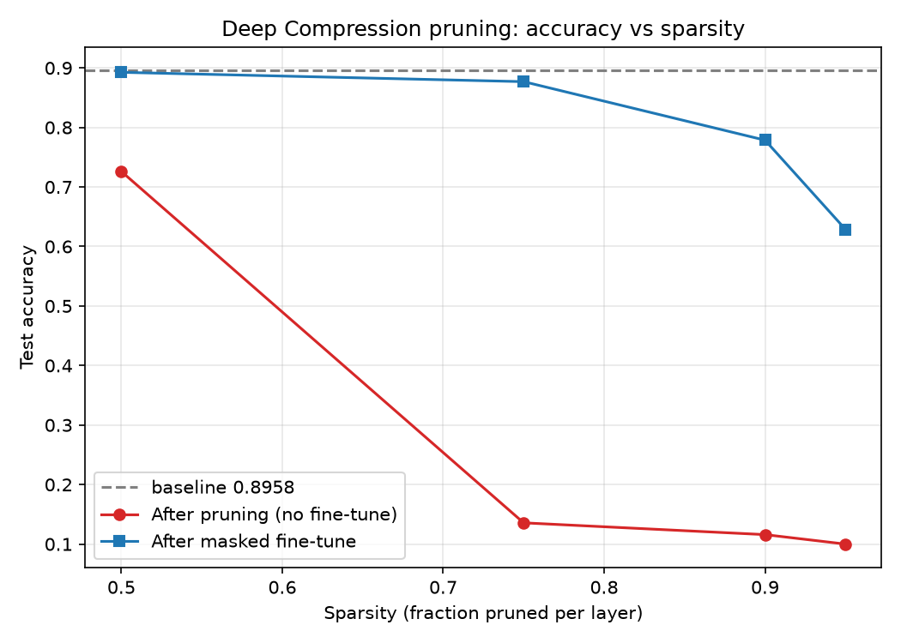
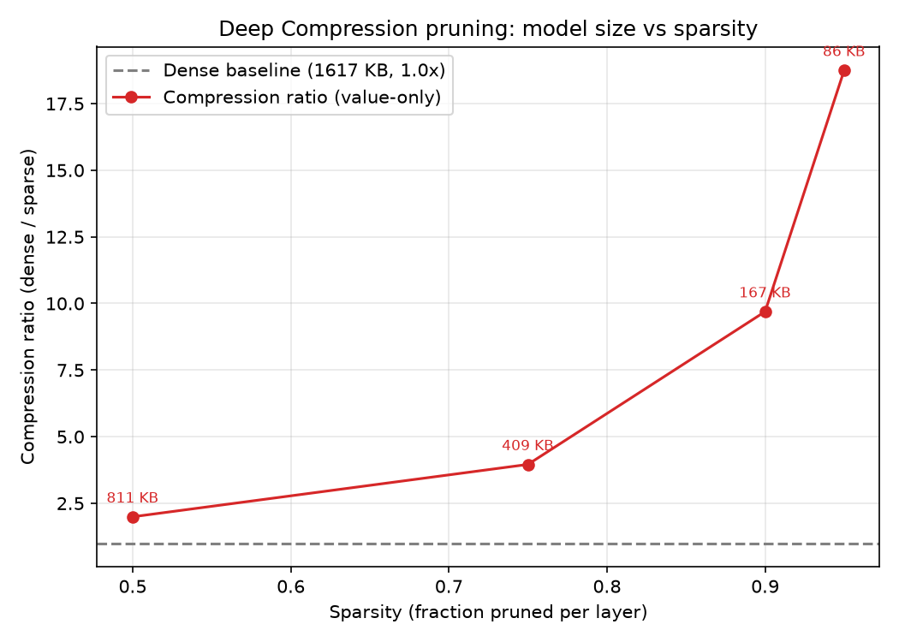

# my-llm-pruning

*使用AI进行代码生成*

尝试复现以下论文中的剪枝操作

1. [Deep Compression: Compressing Deep Neural Networks with Pruning, Trained Quantization and Huffman Coding](https://arxiv.org/abs/1510.00149)
2. [SparseGPT: Massive Language Models Can be Accurately Pruned in One-Shot](https://arxiv.org/abs/2301.00774)
3. [A Simple and Effective Pruning Approach for Large Language Models](https://arxiv.org/abs/2306.11695)

受限于算力，会使用以下模型和数据集

- 从AlexNet修改而来的CNN网络（总参数量 413962） + CIFAR10数据集
- Qwen2.5-3B-Instruct + MATH500数据集

前者我能够快速本地训练和测试，后者我勉强能在本地完成推理

## Deep Compression

### 方法

- 常规训练
- 每层的权重里（无偏置），对于大小小于该层分位数sparsity的权重，直接置为0，得到一个稀疏的网络
- 再对这个稀疏网络进行微调（使用掩码mask仅对剩余权重进行梯度下降）

**后面的全程共享+微调centroids、霍夫曼编码过程略**

对于剪枝后的稀疏网络：

- CSR/CSC格式存储
- 对于CSR下的col_idx数组（或者CSC下是row_idx），再使用index diff储存方式进一步压缩，对于conv层仅需8bits/fc层5bits来存储索引
  - 如果diff超出上限，填充0

## 文件

```
|   log_baseline.txt
|   log_prune.txt
|   model.py            # 训练和评测模型
|   plotting.py         # 画图相关
|   pruning.py          # 剪枝、微调和再评测
|   pruning_results.png # 结果图
```

## 实验



不微调单纯剪枝几乎是不可行的



压缩比基本上等于 1-sparsity 的倒数（因为并没有进行后续的CSR/CSC和diff index，没有原论文的剪枝效果这么好）